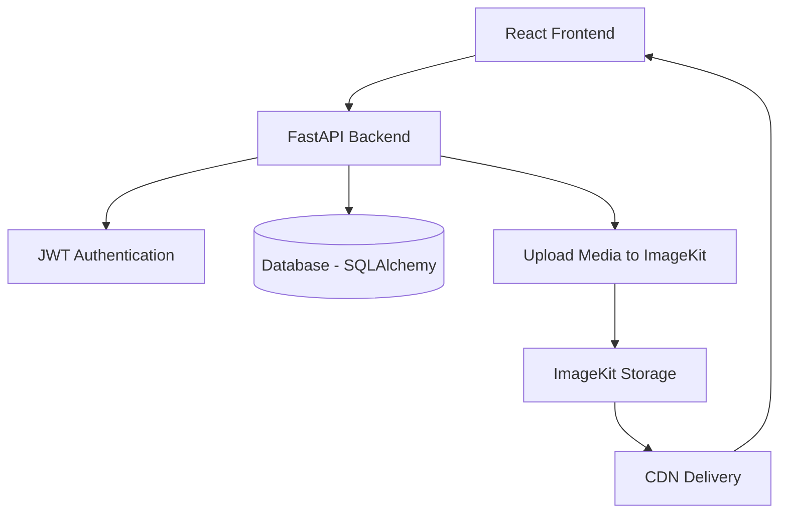

# Hi, I'm Bello-Pluto Salvatore

**Software Developer** with experience building **Fullstack, Network and Multithreading applications**.   
Based in London, UK.  

---

## Tech Stack
- **Languages:** Python, C++, JavaScript
- **Cloud & DevOps:** AWS (EC2, S3, Lambda, IAM, DynamoDB), Docker, CI/CD (GitHub Actions) , Databricks
- **Data & Automation:** Web Scraping (BeautifulSoup, Selenium), Data Analysis, Data Science, Automation.

---

## Projects
Here are a few of my highlighted projects (more on my repository):

- **[Media Sharing Platform (Work in Progress)](https://github.com/MPALONDON/File-storage-and-sharing-platform)**  
  Full-stack media platform where users can upload videos or images, interact through comments and likes, and browse user profiles.
  Features include secure JWT authentication with HTTP-only cookies, media uploads handled through external storage, and a REST API backend.
  
  Tech Stack:
  *React · Vite · FastAPI · JWT Authentication · SQLAlchemy · ImageKit · REST API*

### Architecture

- **[Coding Knowledge Tester](https://github.com/MPALONDON/CodeKnowledgeTester)**  
  Fullstack assessment platform built with FastAPI and React, featuring secure authentication and role-based access.  
  Provides REST APIs for question generation, scoring, and history tracking, backed by SQLAlchemy.  
  Integrated AI-driven question generation and automated feedback using the OpenAI API.

  Tech Stack:
  *React · FastAPI · SQLAlchemy · OpenAI API · Clerk · REST API*
  
- **[Black-Scholes P/L & Heatmap Explorer](https://github.com/MPALONDON/BlackScholes_Price_Streamlit)**  
  Streamlit app for calculating Black-Scholes option prices, simulating P/L based on purchase prices, visualizing interactive heatmaps, and saving results for future reference.  
  *Streamlit · Pandas · NumPy · SciPy · Matplotlib · Seaborn · SQLAlchemy*

- **[Amazon Product Scraper & Tracker](https://github.com/MPALONDON/Product_Tracker)**  
  Flask web app to scrape Amazon products, track price changes, mark favourites, and visualize price history with interactive charts.
  *Flask · SQLAlchemy · SQLite · Pandas · Matplotlib · Bootstrap 5 · Bright Data API*

- **[Python GUI Chat Application](https://github.com/MPALONDON/GUI_Network)**  
  Client-server chat app with a Tkinter GUI, supporting multiple clients, broadcast/private messaging, and administrative controls for managing connected users.  
  *TKinter · Socket · Threading · JSON*

- **[Discord Bot](https://github.com/MPALONDON/discordbot)**  
  A feature-rich bot with moderation, music playback, polls, and role management.  
  *Python · discord.py · SQLAlchemy · FFmpeg*

---
##  Connect with Me
-  Email: **bellopluto@gmail.com**  
-  LinkedIn: [linkedin.com/in/bello-pluto-salvatore-3556b9339/](https://www.linkedin.com/in/bello-pluto-salvatore-3556b9339/)  
-  GitHub: [github.com/MPALONDON](https://github.com/MPALONDON)  

---
